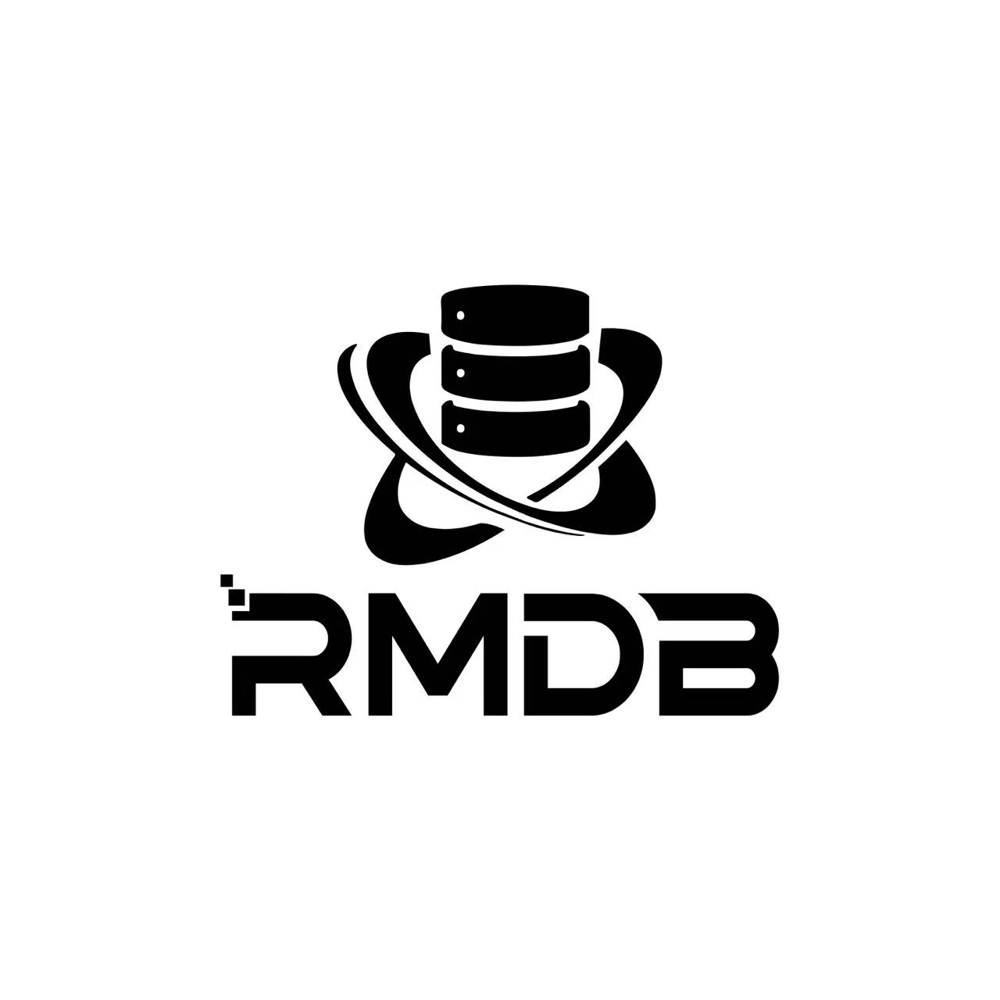

 

RMDB数据库管理系统设计赛提供的代码框架，以培养学生“数据库管理系统内核实现”能力为目标，要求参赛队伍，在大赛提供的原型系统框架基础上，构建一个完整的关系型数据库原型系统，该系统能够支持运行TPC-C基准测试（TPC-C是一个面向联机事务处理的测试基准）提供的常用负载。 RMDB依托中国人民大学杜小勇教授、陈红教授领导的[101计划数据库系统课程工作组](http://101.pku.edu.cn/courseDetails?id=DC767C683D697417E0555943CA7634DE)，委托中国人民大学数据库课程团队进行了开发。平台、赛题和测试用例等均得到了本次大赛技术委员会的支持和帮助，并通过了他们的审核。 

## 实验环境：
- 操作系统：Ubuntu 18.04 及以上(64位)
- 编译器：GCC
- 编程语言：C++17
- 管理工具：cmake
- 推荐编辑器：VScode

### 依赖环境库配置：
- gcc 7.1及以上版本（要求完全支持C++17）
- cmake 3.16及以上版本
- flex
- bison
- readline

欲查看有关依赖运行库和编译工具的更多信息，以及如何运行的说明，请查阅[RMDB使用文档](RMDB使用文档.pdf)

欲了解如何在非Linux系统PC上部署实验环境的指导，请查阅[RMDB环境配置文档](RMDB环境配置文档.pdf)

### 项目说明文档

- [RMDB环境配置文档](RMDB环境配置文档.pdf)
- [RMDB使用文档](RMDB使用文档.pdf)
- [RMDB项目结构](RMDB项目结构.pdf)
- [测试说明文档](测试说明文档.pdf)

## 推荐参考资料

- [**Database System Concepts** (***Seventh Edition***)](https://db-book.com/)
- [PostgreSQL 数据库内核分析](https://book.douban.com/subject/6971366//)
- [数据库系统实现](https://book.douban.com/subject/4838430/)
- [数据库系统概论(第5版)](http://chinadb.ruc.edu.cn/second/url/2)
